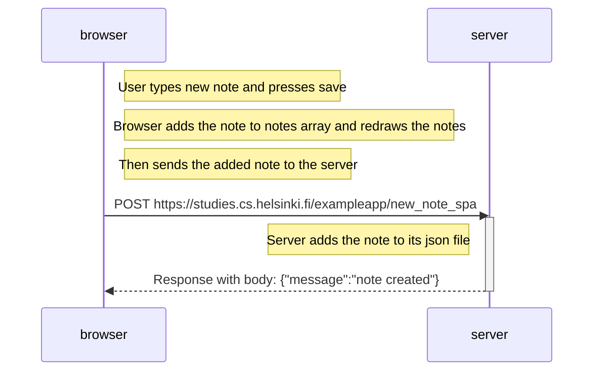

```mermaid
sequenceDiagram
	participant browser
	participant server
	
	Note right of browser: User types new note and presses save
	Note right of browser: Browser adds the note to notes array and redraws the notes
	Note right of browser: Then sends the added note to the server
	
	browser->>server: POST https://studies.cs.helsinki.fi/exampleapp/new_note_spa
	activate server
	Note left of server: Server adds the note to its json file
	server-->>browser: Response with body: {"message":"note created"}
	deactivate server
```